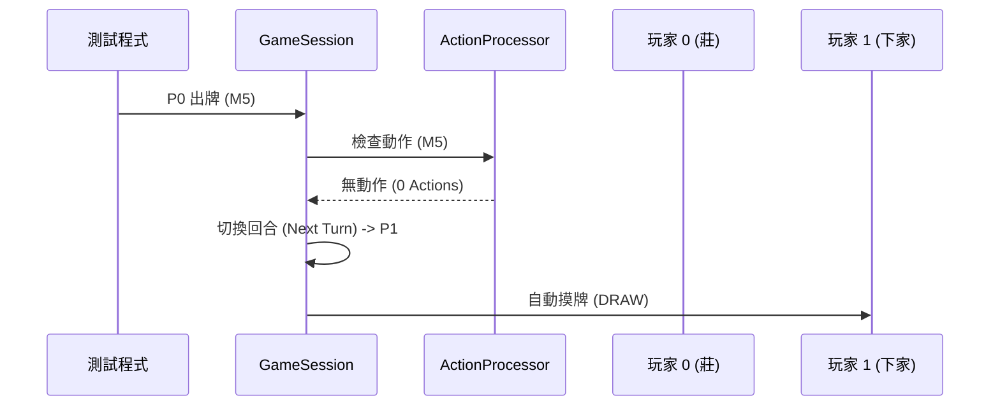
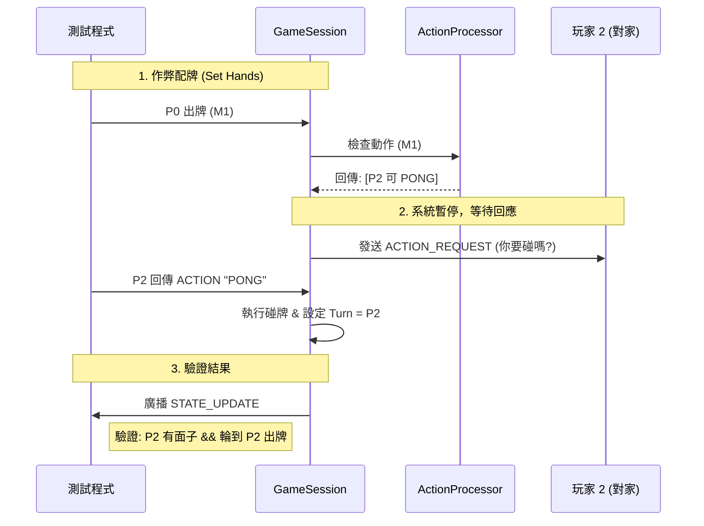

# 麻將遊戲伺服器 - 整合測試報告 (Current Status)
**測試重點：** 遊戲迴圈、動作優先權判定、狀態流轉

---

## 1. 測試概述 (Overview)

目前的整合測試涵蓋了伺服器端的核心邏輯。我們利用 **Mockito** 模擬 WebSocket 連線，並透過 **作弊模式 (Rigged Hand)** 驗證特定情境。

### 測試範圍
1.  **基礎流程：** 驗證發牌、出牌、自動換家摸牌的順序。
2.  **進階流程：** 驗證「碰牌」操作是否能正確攔截回合，並跳過原定下家。

---

## 2. 測試場景 A：標準出牌流程 (Happy Path)

**測試案例：** `testGameFlow`

此場景模擬無人吃碰槓的最基本流程：
1.  **遊戲初始化：** 伺服器啟動，莊家配牌 17 張，閒家 16 張。
2.  **莊家出牌：** 模擬莊家打出一張牌。
3.  **動作判定：** `ActionProcessor` 判定無人可動作。
4.  **回合切換：** 系統自動將回合權交給下家 (Player 1)。
5.  **下家摸牌：** Player 1 收到 `DRAW` 訊號，手牌數變為 17 張。

---

## 3. 測試場景 B：碰牌攔截流程 (Pong Interruption)

**測試案例：** `testPongInterruption`

此場景驗證「動作優先權」與「回合跳躍」邏輯：
1.  **作弊配牌：**
    * 強制設定 **Player 0 (莊家)** 手上有 `M1` (一萬)。
    * 強制設定 **Player 2 (對家)** 手上有兩張 `M1` (對子)。
2.  **觸發條件：** Player 0 打出 `M1`。
3.  **系統攔截：**
    * 伺服器偵測到 Player 2 可碰。
    * 系統**暫停**回合流轉，發送 `ACTION_REQUEST` 給 Player 2。
4.  **執行動作：**
    * 模擬 Player 2 回傳 `PONG` 指令。
    * 伺服器執行碰牌：從 Player 2 手中移除兩張 `M1`，並新增一組公開面子 (Meld)。
5.  **驗證結果：**
    * **回合跳躍：** 檢查 `turnIndex` 是否變為 `2` (Player 2)。
    * **跳過下家：** 驗證 Player 1 (本來的下家) **沒有**摸牌，被成功跳過。

---

## 4. 系統互動圖 (System Interaction)

### 圖表 A：標準流轉 (Happy Path)



### 圖表 B：碰牌攔截 (Pong Scenario)


### 5. 測試執行結果 (Execution Results)
   執行指令： mvn clean verify

Console Output 摘要：
```mermaid
[INFO] Running com.mahjong.integration.MahjongGameIT
...
=== P0 打出 M1 ===
=== P2 喊碰 ===
...
[DEBUG] Received Action: PONG from Player 2
[DEBUG] After PONG: currentPlayerIndex set to 2
P2 最後狀態: {... "allMelds":[..., ["M1","M1","M1"], ...], "turnIndex":2 ...}
測試成功：P2 成功攔截並獲得出牌權
...
[INFO] Tests run: 2, Failures: 0, Errors: 0, Skipped: 0
[INFO] BUILD SUCCESS
```